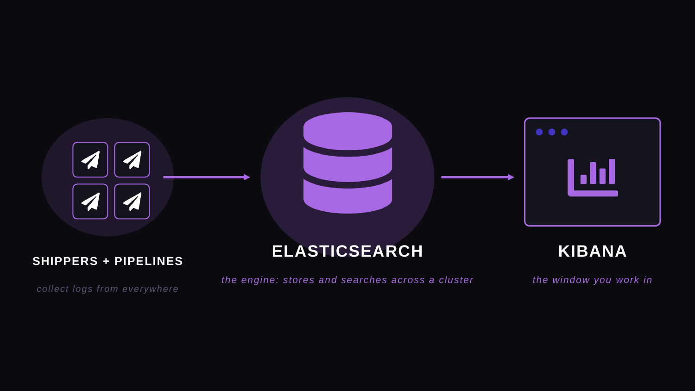
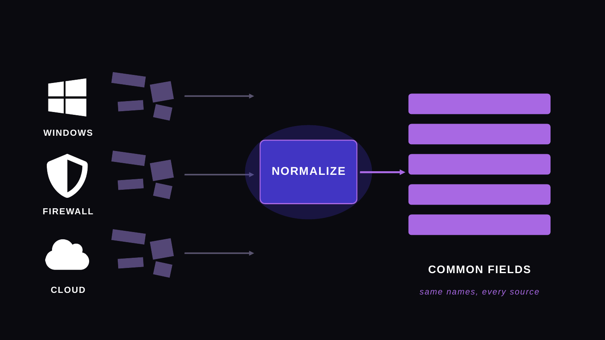
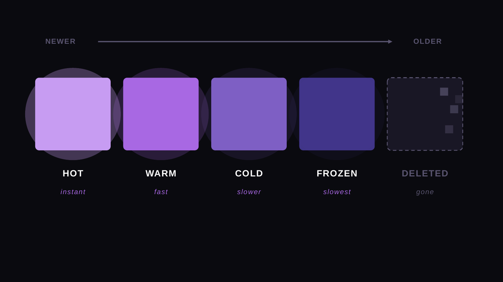
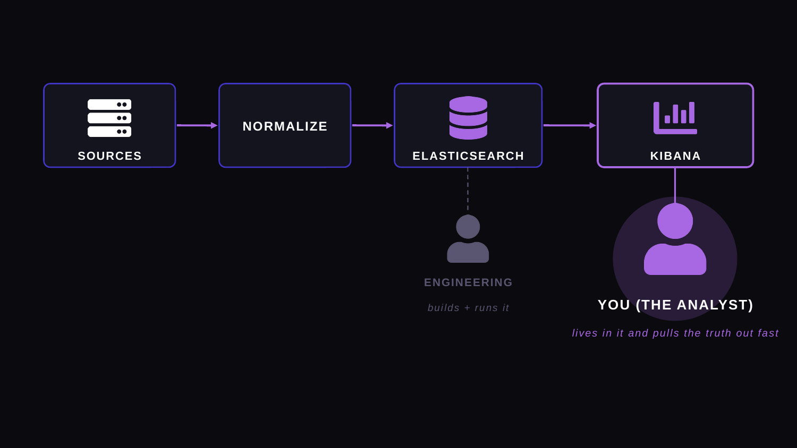

# The Elastic Stack

What the Elastic Stack actually is, how your logs get into it, and where you sit as the analyst who searches it.

---

## Lesson Notes

### The pieces

Three parts. Two you work with directly, one that runs in the background.

- **Elasticsearch** is the engine. It stores your logs and indexes them so you can search across a huge amount of data and get an answer back fast. In a real company it is not one server, it is a cluster of machines splitting the data between them. You ask a question, the cluster brings back the matches. You query, you don't download.
- **Kibana** is the window. The web interface you log into and actually work in.
- **Shippers and pipelines** are the collection layer. Tools like Beats, the Elastic Agent, and Logstash grab logs off every source and send them into the engine.

### How data gets in, and why it looks consistent

Every source writes logs differently. Windows one way, the firewall another, the cloud another. On the way in, the data gets parsed and normalized onto a common set of field names, so the source IP from a firewall and the source IP from a laptop land in the same field. Learn one set of field names and you can search the whole environment at once.

Not every company does this well. A mature shop has it dialed in. Smaller or fast-growing places are still figuring it out, so you will run into messy, inconsistent, or missing fields. That is a read on the environment's maturity, not on you.

### Where it lives, and how it ages out

Data is stored by time and moves through tiers as it ages. Fresh data sits on fast storage and answers instantly. Older data slides onto slower storage, then gets frozen or archived, and past the retention policy it is gone. Pull logs from six months or a year back and the results come back patchy: some there, some gone. That is retention showing its limits, not you searching wrong.

### Where you sit

You don't run the stack. Standing it up, tuning the pipelines, and managing retention is engineering, and you may never touch it unless you move into the specialty side (SIEM engineering, security engineering, or the log and pipeline role). You don't have to build any of it, but you do have to understand how it works, because it changes how you search. The further back you reach, the more the cluster has to dig through and the slower it gets. That is why writing tight queries matters later: your job is to sift an absurd amount of data and get to the answer fast. An inefficient query takes forever, falls over, or buries you in rows you can't act on.

---

## 🧪 Exercise

Time budget: 10 to 15 minutes.

An alert fires for a suspicious login on a Windows server in your company. Using only what this video covered, trace that event through the stack and answer the following. Nothing to install, just reason through it.

1. What grabbed the login event off the Windows server and sent it in?
2. The Windows event and a firewall event use different names for the same thing. What step makes them consistent, and why does that matter for your search?
3. Where is the event stored, and what lets you search across millions of them quickly?
4. What do you actually open to investigate it?
5. The alert turns out to be from eight months ago. Based on the video, what might happen to your search, and why?
6. In one sentence: is standing up and tuning this stack your job as an analyst? Why or why not?

Share: post your answers in the Apprentice Discord thread for this episode.
https://discord.gg/XjHJFp4KSm

What this is really teaching you: you can reason about where data lives and how it moves without ever touching the engineering. That is the analyst mindset.

---

## 🔑 Key Takeaways

- The stack is three things: a collection layer that ships logs in, Elasticsearch that stores and searches them across a cluster, and Kibana, the window you work in.
- Logs from every source get normalized into common field names on the way in, which is what lets you search the whole environment at once.
- Data is stored by time and ages through tiers, so the further back you search the slower it gets, and past retention it is gone.
- You query the stack, you don't run it. Building and tuning it is engineering, a separate path.
- Not every company normalizes well. Messy or missing fields tell you how mature the environment is.

---

## ➡️ What's Next

You understand the system your logs live in. The next step is getting comfortable in the window itself, so you can find your way around the data before you start searching it.

---

[← Back to Week 1 Overview](./README.md) | [Next →](./04-tour-of-kibana.md)
